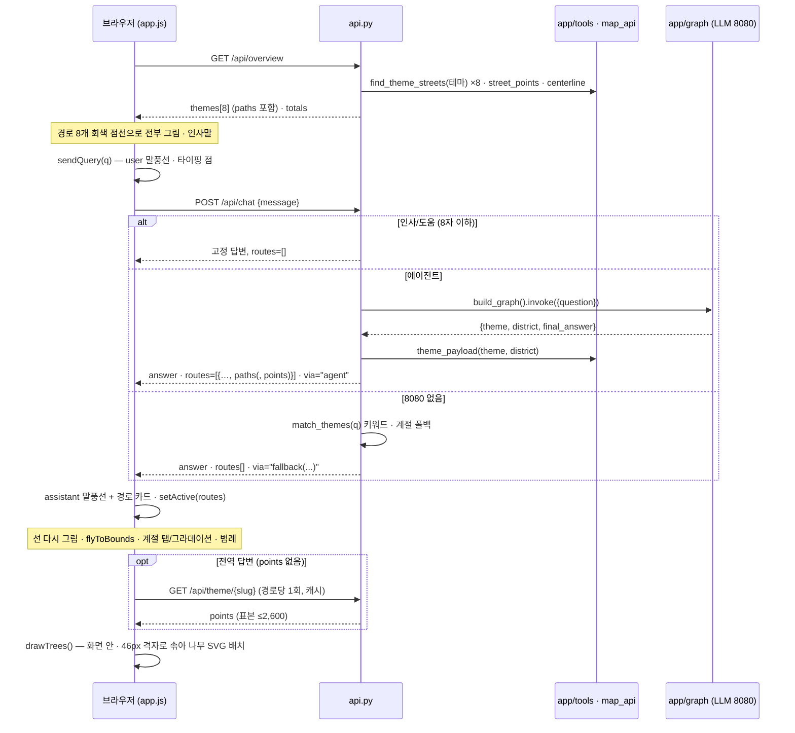

# 서울 가로수길 웹 프론트 — 구성 설명서

Figma Make로 만든 디자인(`figma/서울 벚꽃길 추천 시스템/`)을 실제 가로수 데이터와
langgraph 에이전트에 붙인 프론트다. 이 문서는 **어떻게 구성했는지**와 **다른 브랜치·
프로젝트에 붙일 때 무엇을 맞춰야 하는지**를 적는다.

```
브라우저 ──► web/ (index.html · styles.css · app.js · trees.js)   ← Figma 디자인을 그대로 옮김
                │  fetch('api/…')  상대경로만 사용
                ▼
             api.py (FastAPI)  ── /api/overview · /api/theme · /api/street · /api/chat · /api/health
                │
     ┌──────────┴───────────┐
   app/tools.py · map_api.py   app/graph.py (langgraph) ──► 8080 로컬 LLM (없으면 키워드 폴백)
   data/seoul_tree_data.csv
```

## 0. 바로 띄우기

```bash
pip install -r requirements.txt            # 또는 uv pip install -r requirements.txt
python -m uvicorn api:app --host 0.0.0.0 --port 9000
# → http://localhost:9000
```

- **LLM 서버(8080)가 없어도 뜬다.** 화면·지도·경로 추천·경로 카드가 전부 동작하고, 채팅만
  키워드 매칭 폴백으로 내려간다(답변 끝에 "_(LLM 서버 8080이 꺼져 있어 키워드로 찾았습니다)_").
  LLM까지 쓰려면 `bash /workspace/course/week5/start_agent_server.sh` 또는
  `AGENT_CHANNEL=gemini GEMINI_API_KEY=…`.
- Node·npm·빌드 단계가 **없다.** Leaflet은 cdnjs에서, 글꼴은 Google Fonts에서 받는다.
- `start_web.sh`/`stop_web.sh`는 Runpod 파드 전용(venv·로그 경로가 박혀 있음). 다른 환경에서는
  위의 uvicorn 한 줄을 쓰면 된다.

| 환경변수 | 기본값 | 뜻 |
|---|---|---|
| `TREE_CSV` | `data/seoul_tree_data.csv` | 가로수 원자료(cp949) |
| `AGENT_BASE_URL` | `http://localhost:8080/v1` | 로컬 LLM 서버 (`/api/health`가 상태를 찌른다) |
| `AGENT_CHANNEL` | `local` | `app/llm.py`의 모델 채널 (`local`·`gemini`·`openai`) |

## 1. 왜 React를 빌드하지 않고 바닐라 JS로 옮겼나

Figma Make가 내려준 것은 React 19 + Vite + react-leaflet 앱이다. 그대로 빌드해 서빙하는
대신 **손으로 옮겼다.** 이유:

1. 팀 스택이 Python(FastAPI·Streamlit)이고 파드에 Node가 없다. 빌드 산출물을 커밋하는 것도,
   팀원마다 Node를 깔게 하는 것도 마찰이다.
2. 시안이 작다. `App.tsx` 하나(520줄)에 화면이 전부 있고, 스타일은 인라인 `style={{…}}`,
   컴포넌트는 `TreeMarkers` 하나. 옮기는 데 하루가 안 걸리는 크기다.
3. 시안의 데이터 계층(`routes.ts`·`chatbot.ts`)은 어차피 통째로 버려야 했다 — 목업 좌표와
   숫자다. 살릴 것은 화면과 SVG뿐이었고, 그건 바닐라로도 1:1이다.
4. 결과물이 정적 파일 4개라 FastAPI `StaticFiles` 한 줄로 서빙이 끝난다.

색·치수·동작은 시안 값을 그대로 썼다(§8 토큰 표). 다르게 한 곳은 §9에 전부 적었다.

## 2. 파일 구조

```
api.py                 FastAPI. /api/* 를 만들고 web/ 를 정적으로 서빙. 시안 목업을 실데이터로 바꾸는 곳
web/
  index.html    75줄   뼈대 — 헤더 · 3분할(목록/지도/챗) · 챗 입력.  App.tsx의 JSX 구조
  styles.css   236줄   App.tsx 인라인 style + index.css 토큰을 클래스로 풀어 쓴 것
  app.js       356줄    상태·렌더·지도·챗 — App.tsx의 로직. 데이터는 전부 /api/* 에서
  trees.js     122줄   수종별 나무 SVG 8종 — TreeMarkers.tsx 를 타입만 걷어내고 그대로
app/                   데이터·에이전트 계층. api.py가 import 한다 (§7 계약)
  themes.py            테마 8종 정의 — 수종·계절·bucket. 단일 출처
  tools.py             CSV 로드, find_theme_streets(@tool), check_coverage(@tool)
  map_api.py           street_points() — 노선 하나의 나무 좌표 (UI 전용, @tool 아님)
  graph.py · llm.py    langgraph 에이전트 (intake → researcher → resolver)
  app_streamlit.py · assets.py   초기 Streamlit UI (참고용, 이 프론트는 쓰지 않음)
figma/서울 벚꽃길 추천 시스템/   Figma Make 원본. src/App.tsx · components/TreeMarkers.tsx 가 기준
data/seoul_tree_data.csv        서울시 가로수 위치정보 287,635그루 (cp949)
```

## 3. 화면 구조 — 시안 → 구현 대응

시안 `App.tsx`의 JSX 순서대로. 오른쪽 열은 그 값이 **어디서 오는지**다.

| 시안 (App.tsx) | 구현 (web/) | 값의 출처 |
|---|---|---|
| `<header>` 56px `#1a2e22` | `.topbar` | — |
| 로고: 28px 초록 사각 🌿 + "서울 가로수길" + "WALK SEOUL" | `.brand` | 고정 |
| 계절 탭 봄·여름·가을·사계절 (`cursor:default`, 표시 전용) | `.seasons span[data-active]` · `renderSeasons()` | `state.active[0].season` — 시안과 같이 **필터가 아니라 현재 계절 표시** |
| 통계 3칸 (테마 경로 / 가로수 총계 / 커버 구) | `.stats` | `GET /api/overview → totals` (시안의 219,447 대신 실제 287,635) |
| `<aside>` 260px 테마 목록 | `.side` · `renderList()` | `overview.themes` |
| 목록 항목: 이모지 20px · 이름 13px · 계절 배지 · 자치구 · 활성 점 | `.trow` (`--line`·`--tint` 커스텀 속성으로 테마색) | `emoji`·`name`·`season`·`district`·`color` |
| 목록 클릭 → `sendQuery(name + " 추천해줘")` | `#themelist` click 위임 | 동일 |
| `<MapContainer>` center [37.5326,127.024] zoom 12, zoomControl 없음 | `L.map('map', …)` + 우상단 줌 컨트롤 | 동일 |
| 타일: CARTO light_all | **Esri Light Gray Canvas** (Base + Reference) | §9-1 |
| 모든 경로 `<Polyline>` — 비활성 회색 점선(2px, .25) / 활성 테마색(5px, hover 7px, .55) | `drawLines()` · `lineStyle(r, on)` · `restLayer`/`activeLayer` | `route.paths` — **실제 나무 좌표의 중심선** (§6-1) |
| 활성 경로 sticky Tooltip "이모지 이름 — 노선들" | `bindTooltip(…, {className:'route-tooltip'})` | `emoji`·`name`·`roads` |
| 경로 클릭 → `sendQuery` / hover → 굵기 7 | `bindRoute()` · `setHover()` | 동일 |
| `<TreeMarkers>` 수종 SVG를 경로 위에 흩뿌림 | `drawTrees()` + `trees.js treeIcon()` | SVG는 시안 그대로, **위치는 실제 나무 좌표** (§6-2) |
| `<MapFlyTo>` flyToBounds padding 80, 1.4s, maxZoom 15 | `flyToActive()` | 활성 경로 paths의 bounds |
| 범례 카드 bottom-left "표시된 경로 (N)" | `.legend` · `renderLegend()` | `state.active` |
| 우하단 출처 문구 | `.credit` | 고정 (Esri 저작표시로 교체) |
| `<aside>` 420px 챗 패널, 계절 그라데이션 `transition .9s` | `.chat` · `applySeason()` | `SEASON_BG[currentSeason()]` |
| 챗 헤더(글래스) + 빠른 칩 8개 | `.chat-head` · `.chips` · `renderChips()` | `QUICK_CHIPS` — 시안 라벨·질문 그대로 |
| 말풍선: user 우측 `#1a2e22` / assistant 좌측 글래스 + 🌿 아바타 | `.msg.me .bub` / `.msg .av + .bub` · `bubble()` | `POST /api/chat → answer` |
| 말풍선 안 경로 카드 (이모지·이름·"구 · 시기 · N그루"·색 점) | `.cards .card` · `cardsHtml()` | `chat → routes[]` |
| 카드 클릭 → `sendQuery(name + " 더 자세히 알려줘")` | `#chatlog` click 위임 | 동일 |
| 타이핑 점 3개 `dotBounce` | `.typing i` · `typingBubble()` | 응답 대기 중 |
| 입력창(포커스 시 초록 테두리) + 36px 전송 버튼(비었으면 회색) | `.field` · `#send[disabled]` | — |
| 하단 고지 "서울시 가로수 공개데이터 기반 · 실제 경로와 차이가…" | `.disclaimer` | 고정 |

시안의 `formatMessage()`는 `**굵게**`와 줄바꿈만 처리했다. 에이전트 답변에는 `- 목록`과
`_흐림_`도 오므로 `md()`가 그 넷을 처리한다(그 이상의 마크다운은 그대로 글자로 보인다).

## 4. 데이터 흐름



`state`는 셋뿐이다: `routes`(overview의 8개), `active`(지금 켜진 경로들 — 챗 응답의 객체를
overview 객체 위에 덧씌운 것), `hoverId`. 렌더 함수는 이 셋만 읽고 DOM을 통째로 다시 만든다
(목록·범례·계절탭). 지도 레이어만 `drawLines()`·`drawTrees()`가 따로 지우고 다시 그린다.

## 5. API 계약

모두 JSON. 프론트는 **상대경로**(`api/…`)로 부르므로 프록시 뒤 어느 경로에 매달아도 된다.

### `GET /api/overview`
```json
{
  "themes":  [ Route, … 8개 ],
  "totals":  { "themes": 8, "trees": 287635, "districts": 25 },
  "buckets": ["봄","여름","가을","사계절"],
  "coverageNote": "287,635그루 · 25개 자치구(+서울시설공단·중부공원여가센터 관리 구간)"
}
```
**Route** — 시안 `routes.ts`의 `Route` 타입과 같은 이름을 썼다:

| 필드 | 예 | 출처 |
|---|---|---|
| `id` | `"cherry"` | `api.PRESENTATION[key].slug` — trees.js SVG 키와 같음 |
| `emoji` `name` `nameEn` | 🌸 · 벚꽃 봄산책길 · Cherry Blossom Spring Walk | `EMOJI` · `themes.label` · `PRESENTATION` |
| `bucket` `season` `seasonLabel` | 봄 · `"spring"` · 봄(3~4월) | `themes.bucket` · `SEASON_EN[bucket]` · `themes.season` |
| `district` | 관악구·금천구 | 상위 노선의 자치구 앞 두 곳 (`…구`만) |
| `roads` | `["올림픽대로","난곡로"]` | 상위 노선 앞 두 개 |
| `treeType` `treeCount` | 벚나무류 · 32966 | `PRESENTATION` · `find_theme_streets → total_trees` |
| `color` `mode` | `#e8a0b0` · `prefer`/`avoid` | `PRESENTATION` · `themes.mode` |
| `description` `note` | … | `PRESENTATION`(수종·시기만) · `themes.note` |
| `paths` | `[[[lat,lon],…], …]` | **§6-1 centerline** — 상위 6노선의 선 전부 |

### `GET /api/theme/{slug}`
Route 전체 + `streets[{rank, gu, line, count, center, paths}]` + `points`(표본 좌표 ≤2,600)
+ `focus{center,bbox}` + `key`(테마 한글 키). 나무 마커용 좌표는 여기서만 받는다.

### `GET /api/street?slug=&gu=&line=`
`{gu, line, count, points[[lat,lon]…], bbox}` — 노선 하나의 나무 전부(≤1,500). 지금 화면은
쓰지 않지만 노선 단위 확대를 붙일 때를 위해 남겨 둠.

### `POST /api/chat`  `{ "message": "강남구 벚꽃길" }`
```json
{
  "answer": "강남구 벚꽃길 추천 코스는 자곡로(291그루), …",
  "routes": [ { "id":"cherry", "emoji":"🌸", "name":"벚꽃 봄산책길",
                "district":"강남구", "seasonLabel":"봄(3~4월)", "treeCount":1716,
                "color":"#e8a0b0", "season":"spring",
                "paths":[…강남구 안 노선들만…], "points":[…906개…] } ],
  "via": "agent"
}
```
- `routes`는 **배열**이다. 시안 `matchRoutes()`처럼 "가을"만 말하면 가을 테마 셋이 다 온다.
- 에이전트가 자치구를 집어내면 `district`·`treeCount`·`paths`가 그 구로 좁혀지고 `points`가
  같이 실린다. 전역 답변이면 `points`는 없고 프론트가 `/api/theme/{id}`를 한 번 부른다.
- `via`: `builtin`(인사·도움 고정 답변) · `agent`(langgraph) · `fallback(예외명)`(8080 없음).

### `GET /api/health`
`{ok, trees, districts, agent_reachable}`.

## 6. 시안 목업을 실데이터로 바꾼 방법

### 6-1. 노선 폴리라인 — `api.centerline()`
시안 `routes.ts`에는 노선마다 손으로 찍은 4~5점짜리 직선이 있었다. 여기서는 그 노선에
실제로 심긴 나무 좌표(수백~수천 점)에서 **중심선을 접는다**:

1. 좌표를 (위도, 경도·cos위도)로 눌러 미터 비율을 맞추고 **주축(PCA 1축)**을 구한다.
2. 각 나무를 주축에 투영해 한 줄로 세운다.
3. 주축 길이에 비례해 마디 수를 잡는다(**약 220m마다 하나, 최대 60**). 마디마다 좌표 평균.
4. 마디 사이가 그 노선 **간격 중앙값의 4배**(최소 700m)를 넘으면 선을 끊는다 — 같은
   도로명이 지도에서 두 토막인 경우가 실제로 있고, 그 사이를 이어 그으면 없는 길을 만든다.
5. 끊고 250m 미만으로 남은 토막은 버린다.

처음엔 마디를 24개로 고정했는데, 올림픽대로(36km)는 마디 간격이 1.5km까지 벌어져
두 마디짜리 토막 다섯 개로 부서졌다. 그래서 길이 비례 + 상대 문턱으로 바꿨다. 결과:
보통 노선(3km)은 선 1개 12~20마디, 올림픽대로는 나무가 실제로 뭉쳐 있는 구간별로 선
여러 개. **선의 모양이 진짜 가로수 배열을 따른다.**

### 6-2. 나무 마커 — `drawTrees()` + `trees.js`
시안은 폴리라인 마디 사이를 보간해 그 위에 일정한 오프셋으로 나무를 흩뿌렸다. 여기서는
그림(SVG)은 시안 것을 그대로 쓰되 **위치를 실제 나무 좌표**로 한다:
- 좌표 표본은 테마당 ≤2,600(`/api/theme`), 구 스코프면 그 구의 전부.
- 현재 화면 범위(`getBounds().pad(0.1)`) 안만, 화면 픽셀 **46px 격자에 한 칸 하나**만 남긴다.
- 상한 170개 / 켜진 경로 수. `zoomend`·`moveend`마다 다시 → 확대하면 나무가 늘어난다.
- 크기 변주 `SIZE_VARIANTS` 10단계는 시안 그대로(인덱스 `(i*7)%10`).

### 6-3. 숫자·자치구·노선
`treeCount`·`district`·`roads`·`streets`는 전부 `tools.find_theme_streets`의 집계다.
시안 `description`에는 노선 이름이 문장에 박혀 있었는데("강남대로와 노원 동일로가 대표
구간") 실제 1위는 올림픽대로였다. 그래서 description은 **수종·시기만** 말하게 다시 썼고
노선은 데이터가 채운다.

### 6-4. 챗봇
시안 `chatbot.ts`의 세 분기(인사 / 도움 / 경로 매칭)를 `api.chat()`이 그대로 갖되,
경로 매칭 자리를 **langgraph 에이전트**로 바꿨다. 에이전트가 없을 때만 시안 방식의
키워드·계절 폴백(`match_themes`)이 돈다. 답변 문장 형식(`route_reply`)도 시안
`formatRouteReply`와 같고, 숫자·노선만 실데이터다.

## 7. 다른 브랜치·프로젝트에 붙이기

프론트(`web/`)는 백엔드를 **§5 계약으로만** 안다. `api.py`는 `app/`을 **아래 네 가지로만**
안다. 이 네 가지만 맞으면 나머지는 갈아 끼울 수 있다.

```python
# 1) 테마 정의 — dict[str, dict]
from themes import THEMES          # THEMES[key] = {label, mode, species, season, bucket, note}

# 2) 노선 집계 — langchain @tool (invoke로 부른다)
from tools import find_theme_streets, _load, available_districts
find_theme_streets.invoke({"theme": key, "district": ""})
# → {ok, theme, mode, season, district, total_trees,
#    streets:[{구, 노선, 그루수, center:[lat,lon]}], focus:{center,bbox}, note}

# 3) 노선 하나의 나무 좌표
from map_api import street_points
street_points(gu, line, key, limit=1200)   # → [[lat, lon], …]

# 4) 에이전트 — 질문 → 테마·자치구·답변
from graph import build_graph
build_graph().invoke({"question": q})      # → {theme: key|'unknown', district: str, final_answer: str}
```

**에이전트가 다른 브랜치**(예: `develop`의 supervisor 그래프)에 붙일 때: `api.py`의
`chat()` 안 `_GRAPH.invoke(…)` 한 군데만 바꾸면 된다. 프론트가 필요한 건 셋이다 —
테마 키, 자치구 문자열(없으면 `""`), 답변 문자열. 나머지는 `theme_brief(key, district)`가
만든다.

**테마를 추가**할 때: ① `app/themes.py`에 항목(`bucket`은 봄·여름·가을·사계절 중 하나)
② `api.PRESENTATION`에 `slug·nameEn·color·treeType·description·keywords`, `EMOJI`에 이모지
③ `web/trees.js TREE_SVGS`에 slug 키로 SVG(없으면 `shade` 그림으로 대체된다).

**정적 파일만 가져갈** 때: `web/` 네 파일은 서로 외에 아무것도 모른다. §5 계약을 지키는
어떤 백엔드 밑에 두어도 되고, 경로는 상대이므로 `/anything/` 밑에 매달아도 된다.

**프록시(Runpod 등) 뒤**: `--host 0.0.0.0`으로 띄우고 노출 포트의 프록시 URL로 접속.
WebSocket을 안 쓰므로 Streamlit 때 필요했던 CORS/XSRF 옵션이 없다.

## 8. 디자인 토큰 (시안 값 그대로)

| 무엇 | 값 |
|---|---|
| 배경 · 본문 · 카드 | `#f5f3ef` · `#1a1a18` · `#ffffff` |
| muted · muted-fg · faint · border | `#e8e5df` · `#7a7770` · `#9a9690` · `#dbd8d2` |
| primary · accent · 헤더 | `#2d6a4f` · `#52b788` · `#1a2e22` |
| 계절 봄 · 여름 · 가을 · 겨울 · 사계절 | `#e91e8c` · `#2d6a4f` · `#e76900` · `#1565c0` · `#546e7a` |
| 테마색 cherry/shade/ipaeb/ginkgo-avoid/ginkgo-enjoy/metasequoia/maple/evergreen | `#e8a0b0` `#2d6a4f` `#b7e4c7`→`#7fb99a`* `#f4a261` `#f9c74f` `#40916c` `#e76f51` `#1b4332` |
| 헤더 높이 · 좌측 · 우측 폭 | 56 · 260 · 420 px |
| 계절 탭 · 배지 · 칩 · 말풍선 · 카드 반지름 | 20 · 10 · 20 · 18/4 · 12 px |
| 말풍선 최대 폭 · 글자 · 줄간 | 78% · 14px · 1.65 |
| 글꼴 | Noto Sans KR (400·500·600·700), 보조 Instrument Sans |
| 배지 틴트 · 목록 활성 틴트 · 카드 틴트/호버/테두리 | 색 + `18` · `12` · `15`/`28`/`44` (8자리 hex 알파) |

\* 이팝 색은 시안 `#b7e4c7`이 아니라 `#7fb99a`다. `api.PRESENTATION`에 처음부터 그렇게 들어 있었고(흰 바탕에서 시안 색이 묻혀 보이는 문제로 보인다) 이번에 건드리지 않았다.

## 9. 시안과 다르게 한 곳 (전부)

1. **타일: CARTO → Esri Light Gray Canvas.** CARTO `light_all`은 이제 키 없이 부르면 타일마다
   "API KEY REQUIRED" 워터마크가 찍혀 온다. 같은 무채색 계열이고 키가 필요 없는 Esri로
   바꿨다. 글자 레이어(Reference)는 밑그림과 같은 pane에 두어 경로선이 늘 위에 오게 했다.
2. **나무 위치 = 실제 좌표** (§6-2). 그림은 시안 그대로.
3. **Leaflet 기본 attribution 끔.** 시안은 기본 컨트롤과 자체 우하단 문구를 둘 다 켜 서로
   겹쳤다. 자체 문구 하나에 Esri 저작표시를 넣었다.
4. **도움 분기 문턱 15자 → 8자.** 시안은 "추천" 같은 낱말이 있고 15자 미만이면 무조건
   테마 메뉴를 돌려줬다. 그러면 "제주도 돌담길 추천해줘"(12자)까지 메뉴로 새어 나가
   에이전트의 "데이터에 없다" 경로를 건너뛴다. 이 프로젝트의 채점축이 그 정직한 거절이라
   낮췄다.
5. **자치구 스코프.** 시안의 Route에는 구 개념이 없다. 에이전트가 "강남구"를 집어내면
   답변은 강남구 노선을 말하는데 지도는 올림픽대로가 켜지는 어긋남이 생겨,
   `theme_payload(key, district)`로 좁힌 경로선·나무를 응답에 실어 보낸다.
6. **description에서 노선 이름 제거** (§6-3).
7. `md()`가 목록·흐림까지 처리 (§3 끝).

시안대로 **두었지만 오해하기 쉬운 것**: 상단 계절 탭은 필터가 아니다. 시안이 `cursor:default`
표시 전용으로 만들었고, 켜진 경로의 계절을 비추기만 한다.

## 10. 검증한 것

- Playwright(Chromium 1600×900)로 6장면 스크린샷 — 초기 / 목록 클릭(가을 은행) / 칩 클릭(벚꽃)
  / 입력→타이핑 점 / "강남구 벚꽃길" 구 스코프 / 메타세쿼이아 hover. 콘솔 오류 0,
  실패 요청 0(팬 중 취소된 타일 요청 제외).
- 초기 화면에 비활성 폴리라인 59개 렌더, 전송 버튼이 입력 시 활성화, hover 시 6개 선이
  굵기 7로, 툴팁 "🌲 메타세쿼이아 이국길 — 양재천로, 남부순환로".
- `curl` — 인사→`builtin`, "가을 은행나무 단풍길"→`agent`+카드 1, "제주도 돌담길 추천해줘"→
  에이전트가 정직하게 거절(`routes: []`), "강남구 벚꽃길"→`district=강남구`·1,716그루·경로 6·좌표 906.

## 11. 알려진 한계

- **자동차전용도로가 상위에 온다.** 벚꽃·그늘·이팝 모두 1위가 서울시설공단 올림픽대로다.
  나무가 가장 많은 노선이 그것이라 데이터로는 맞지만 걷는 길로는 아니다. 보행 가능성
  필터는 데이터 계층(`find_theme_streets`)의 몫이고 이 프론트는 받은 순서대로 보여 준다.
- 폴리라인은 나무 좌표의 **중심선 근사**다. 도로 기하와 다를 수 있다(하단 고지 문구가
  그 뜻이다). 도로망 스냅(osmnx)은 후속 과제.
- `start_web.sh`류는 파드 경로가 박혀 있다. 다른 환경은 §0의 uvicorn 한 줄.
- 반응형이 아니다. 시안이 데스크톱 고정(260 + flex + 420)이라 그대로 뒀다.
